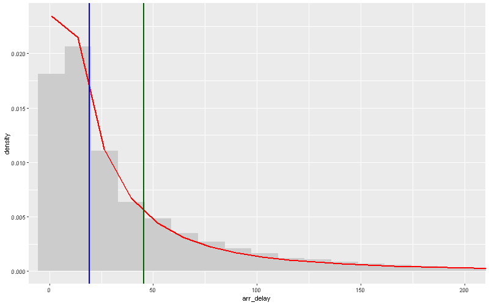

\# Flight Delay Modelling

This project models airline arrival delays using parametric probability distributions.

\## Data

Dataset: `nycflights13`  

Variable: arrival delay (`arr\_delay`)

We analyse positive arrival delays.

\## Model

We assume delays follow a lognormal distribution:

X ~ Lognormal(μ, σ)

This implies:

ln(X) ~ Normal(μ, σ²)

Parameters are estimated using Maximum Likelihood.

\## Model comparison

Two distributions were fitted:

\- Gamma

\- Lognormal

The lognormal model provided the better fit according to AIC.

\## Results

Estimated parameters:

μ = 2.9636  

σ = 1.3084

Key quantities:

P(X ≤ 5 min) ≈ 0.15  

P(X > 60 min) ≈ 0.19  

Expected delay:

E\[X] ≈ 45.6 minutes

Standard deviation:

SD(X) ≈ 97 minutes

\## Interpretation

The delay distribution is strongly right-skewed with a heavy tail.  

Rare large delays substantially increase the mean delay.

## Distribution of arrival delays

